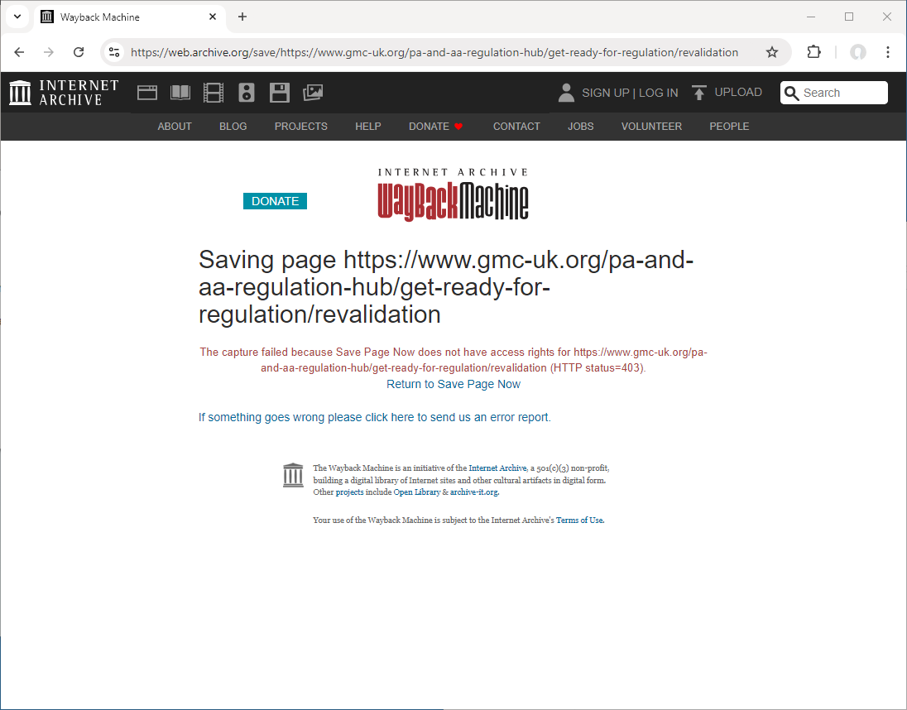
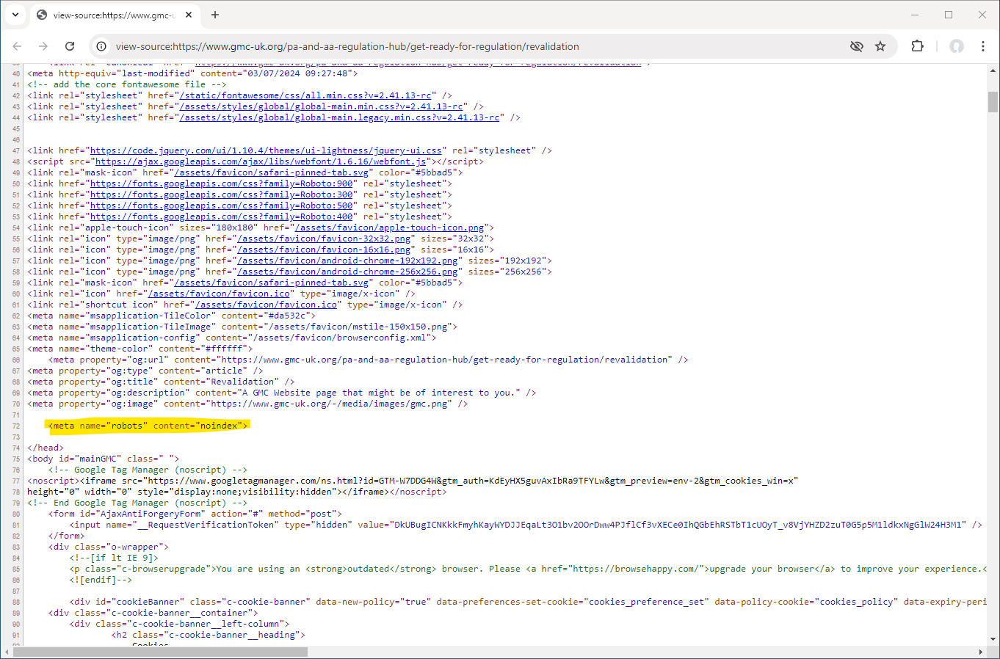
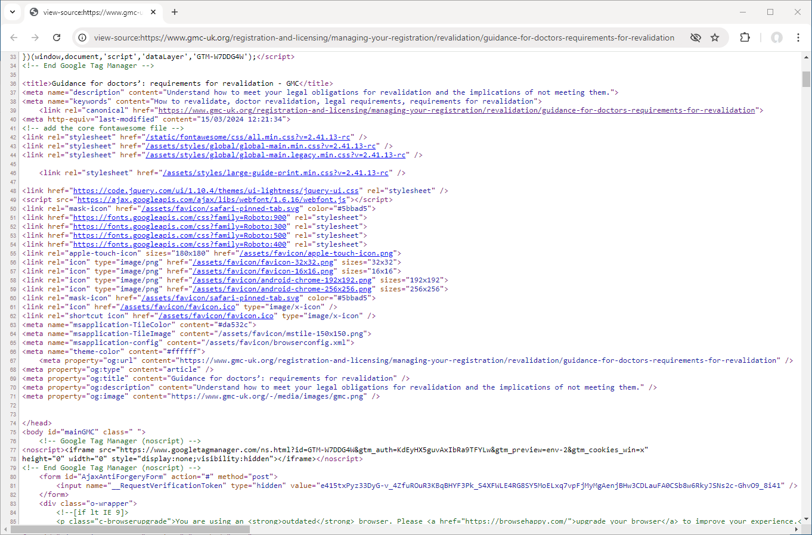

# The GMC - A Regulator Afraid of Transparency?
{:.no_toc}

Over the last week it has become apparent that the [General Medical Council](https://www.gmc-uk.org/){:target="_blank"} (GMC) - the UK [<abbr title="Professional Standars Authority">PSA</abbr>](https://www.professionalstandards.org.uk/){:target="_blank"} Regulator for Doctors[^1] - has been systematically hiding content publish on its website relating to PAs and AAs from Search Engines and blocking [The Internet Archive](https://web.archive.org/){:target="_blank"} from archiving snapshots of their website.

[^1]: The GMC will also soon regulate the misleadingly named: _Physician Associates_ (née _Physician Assistants_) and _Anaesthesia Associates_ (née _Physician Assistants (Anaesthesia)_)

{: class="info"}
> While there is certainly considerable controversy about the role of PAs & AAs, the decision for the GMC to become their regulator, and scope of practice this post is singly about the behaviour and actions of the GMC. It is unfortunately the case that the lack of transparency and candour being demonstrated relates to information on PAs and AAs.

- ToC List
{:toc}

## An Accidental Discovery

I initially discovered that something was wrong on Monday the 16th of September 2024 when I attempted to archive the [this](https://www.gmc-uk.org/pa-and-aa-regulation-hub/get-ready-for-regulation/revalidation){:target="_blank"} page on the GMC website providing information on the future process of revalidation for PAs and AAs and encountered the following:

<figure>
    <a href="gmc-a-regulator-afraid-of-transparency/spn-403-error.png" target="_blank"></a>
    <figcaption>Screen capture of the Internet Archive "Save Page" for <a href="https://www.gmc-uk.org/pa-and-aa-regulation-hub/get-ready-for-regulation/revalidation" target="_blank">https://www.gmc-uk.org/pa-and-aa-regulation-hub/get-ready-for-regulation/revalidation</a> showing a 403 (Forbidden) error received by the Archive.org crawler from the GMC website when attempting to archive it</figcaption>
</figure>

Now there are a number of reasons why the archive.org crawler might be blocked from accessing a website so this error alone shouldn't be taken as evidence of a deliberate systematic attempt to prevent archiving of pages. 

If we look at the homepage of the GMC website and scroll back to [2022 in the Internet Archive](https://web.archive.org/web/20221101000000*/https://www.gmc-uk.org/){:target="_blank"} we can see that crawlers start to encounter 4xx errors (denoted by the orange colour coding on the calendar view) on the _24th of September 2022_[^2]. These appear to be successful captures of the page but if you view the [archived copy](https://web.archive.org/web/20240727195452/https://www.gmc-uk.org/){:target="_blank"} it is an error message from [Cloudflare](https://www.cloudflare.com/){:target="_blank"}:

[^2]: Yes if you continue to scroll back to 2021 there is a 4xx error on the 27th of February but this appears to be much more likely either a genuine server error or misconfiguration by the crawler.

> <big>Sorry, you have been blocked</big>  
> You are unable to access gmc-uk.org

This blocking only impacts specific archivists/ bots (that majority of which appear to be run directly by the Internet Archive directly or on behalf of clients/ institutions)[^3] while permitting others e.g [Common Crawl](https://archive.org/details/commoncrawl){:target="_blank"}, [GDELT Project](https://archive.org/details/GDELT_Project){:target="_blank"} (that are independent of the Internet Archive) to continue to preserve snapshots. This pattern is repeated across the whole GMC website not just the home page.

[^3]: The impacted archivists/ bots included:
    - [ArchiveBot](https://archive.org/details/archivebot){:target="_blank"} - `ArchiveBot` is one of the crawlers operated by [Archive Team](https://en.wikipedia.org/wiki/Archive_Team){:target="_blank"} a group dedicated to digital preservation and web archiving.
    - [Save Page Now](https://archive.org/details/save-page-now){:target="_blank"} - The Internet Archives own tool to [save a page now](https://web.archive.org/save){:target="_blank"}
    - [Save Page Now Outlinks](https://archive.org/details/save-page-now-outlinks){:target="_blank"} - A bot that is part of the Internet Archive's [Save Page Now](https://web.archive.org/save){:target="_blank"} tool that archives linked pages from those added 
    - [Archive-It](https://archive.org/details/archiveitdigitalcollection){:target="_blank"} - The subscription web archiving service of the Internet Archive
      - [The Public Record Office of Northern Ireland (PRONI)](https://archive.org/details/ArchiveIt-Partner-1423){:target="_blank"} - As a client of Archive-It
      - [Sexual and Gender Minority Health web archive](https://archive.org/details/ArchiveIt-Collection-23049){:target="_blank"} - A selective collection of web resources archived by the National Library of Medicine beginning in 2024 related to Sexual and Gender Minority health as a client of Archive-It
      - [National Library of Medicine](https://archive.org/details/ArchiveIt-Partner-350){:target="_blank"} - As a client of Archive-It
    - [Certificate Transparency](https://archive.org/details/certificate-transparency){:target="_blank"}
    - [LAC Domain Harvest 2024](https://archive.org/details/LAC_2024){:target="_blank"} - An archive crawl performed by Internet Archive on behalf of the Library and Archives Canada in January-March, 2024
    - [Custom Crawl Services](https://archive.org/details/customcrawlservices){:target="_blank"} - Large-scale web harvests and national domain crawls performed for National Libraries by the Internet Archive
    - [Save Page Now - Cloudflare](https://archive.org/details/spn-cloudflare){:target="_blank"} - A bot that is part of the Internet Archive's [Save Page Now](https://web.archive.org/save){:target="_blank"} tool

{: id="multiple-archivists"}
It is worth explaining that while the Internet Archive appears to be one single service is actually hosts captured pages from multiple different archivists (and their bots) not just pages saved by their own crawler (`archive.org_bot`).

## Asking the GMC

As seems to be only way to get a response from the GMC I took to Twitter to ask them about this (and bring lots of eyeballs to their behaviour):

<blockquote class="twitter-embed">
  <header>
    
    <div class="name">
      Mike
      <div class="handle">@blu3id</div>
    </div>
  </header>
  <p>
    Hey <a href="https://twitter.com/gmcuk" target="_blank">@gmcuk</a> why are you blocking <a href="https://twitter.com/internetarchive" target="_blank">@internetarchive</a> from saving pages on your website? This seems to be fairly intentional not a &quot;configuration issue&quot;. Why don&#39;t you want a historic record of things you published to exist?
  </p>
  <a class="img" href="gmc-a-regulator-afraid-of-transparency/spn-403-error.png" target="_blank"></a>
  <a class="permalink" href="https://twitter.com/blu3id/status/1835769600811884710" target="_blank">
    <time datetime="2024-09-16T19:55:54.000Z">8:55 pm · September 16, 2024</time>
  </a>
</blockquote>

After picking this up at ~10am the GMC social media team allegedly looked into this with their IT department to come up with the following response:

<blockquote class="twitter-embed">
  <header>
    
    <div class="name">
      GMC
      <div class="handle">@gmcuk</div>
    </div>
  </header>
  <a class="reply-to" href="https://twitter.com/gmcuk/status/1835970990523797689" target="_blank">
    Replying to @gmcuk, @blu3id and @internetarchive
  </a>
  <p>
    Hi Mike. We've checked on this with our IT team. There isn't anything in our systems that's preventing information from our website to be archived. We'll contact the archive website to report this. Thank you.
  </p>
  <a class="permalink" href="https://twitter.com/gmcuk/status/1836061658373914626" target="_blank">
    <time datetime="2024-09-17T15:16:26.000Z">4:16 pm · September 17, 2024</time>
  </a>
</blockquote>

The error in my original complaint clearly shows that the Internet Archive [Save Page Now](https://web.archive.org/save){:target="_blank"} crawler received a _[HTTP 403 Forbidden](https://developer.mozilla.org/en-US/docs/Web/HTTP/Status/403){:target="_blank"}_ error demonstrating that the issue is not with the Internet Archive but the GMC web server or likely in this case the [CDN](https://www.cloudflare.com/en-gb/learning/cdn/what-is-a-cdn/){:target="_blank"}([Cloudflare](https://www.cloudflare.com/){:target="_blank"}) configured by the GMC IT team to protect it.

{: id="possible-explanations"}
Therefore this response demonstrates one or a combination of the following:

1. Lack of competence from the GMC IT team

    Demonstrated by the seeming inability to understand the basics of how the internet works and common error codes (403) and their meaning, not to mention how they have configured the GMC website infrastructure.

2. Failure to consult / adequately communicate with IT by the social media team

    It is possible the social media team didn't share the Tweet and/or attached screen capture showing the error information to the IT team and so got an inadequate response. They may also have not asked the IT team and constructed a response themselves. Some other communication failure may also have occurred.

3. Wilful obfuscation of an established policy and technical countermeasures to enforce it

    It is possible that someone in the chain of responding to this query wilfully decided to obscure a policy to block the Internet Archive crawlers. Or the policy to block the crawlers is only known to a few individuals e.g Cloudflare configuration was updated but not widely documented or shared with the whole IT team.

## A Damning Further Discovery

Engaging in the discussion on Twitter surrounding my initial public question led me to more closely analyse the page that had initially been blocked and led to the discovery of a subtle difference in the raw HTML source code compared to other similar pages on the GMC website.

This page (and the other pages in the same section on PA and AA regulation) carried an additional [meta tag](https://developer.mozilla.org/en-US/docs/Web/HTML/Element/meta){:target="_blank"}: `<meta name="robots" content="noindex">` this extra bit of code tells internet search engines that [the page must not be indexed](https://developers.google.com/search/docs/crawling-indexing/block-indexing){:target="_blank"} and prevents it showing in search results on e.g Google.

<figure>
    <a href="gmc-a-regulator-afraid-of-transparency/pa-and-aa-revalidation-source.png" target="_blank"></a>
    <figcaption>Screen capture of the source code for the <a href="https://www.gmc-uk.org/pa-and-aa-regulation-hub/get-ready-for-regulation/revalidation" target="_blank">https://www.gmc-uk.org/pa-and-aa-regulation-hub/get-ready-for-regulation/revalidation</a> page showing the additional <code>&lt;meta name=&quot;robots&quot; content=&quot;noindex&quot;&gt;</code> tag</figcaption>
</figure>

The concerning thing is that this extra instruction to hide pages from search results appears to be limited to pages on PAs and AAs. Looking at a similar page on revalidation but for Doctors we find the following source code that lacks the extra `meta` tag.

<figure>
    <a href="gmc-a-regulator-afraid-of-transparency/doctor-revalidation-source.png" target="_blank"></a>
    <figcaption>Screen capture of the source code for the <a href="https://www.gmc-uk.org/registration-and-licensing/managing-your-registration/revalidation/guidance-for-doctors-requirements-for-revalidation" target="_blank">https://www.gmc-uk.org/registration-and-licensing/managing-your-registration/revalidation/guidance-for-doctors-requirements-for-revalidation</a> page showing empty space were the the additional &lt;meta name=&quot;robots&quot; content=&quot;noindex&quot;&gt; tag was on the other page</figcaption>
</figure>

Now while using the `<meta name="robots" content="noindex">` is an established method of excluding pages from search results it presents an issue if you are trying to discover which pages on a website have been excluded. The only method is to manually examine pages. The more usual method is to use a [`robots.txt`](https://www.robotstxt.org/robotstxt.html){:target="_blank"} file but if we examine the GMCs we find the following which is unhelpful in determining if only PA and AA pages are being excluded:

```
User-agent: *
Allow: /
Sitemap: https://www.gmc-uk.org/sitemap_gmc_en.xml
Sitemap: https://www.mpts-uk.org/sitemap_mpts_en.xml
Sitemap: https://gde.gmc-uk.org/sitemap_gde_en.xml
Sitemap: https://edt.gmc-uk.org/sitemap_edt_en.xml
```

Back on Twitter the community had also been investigating and found that a _News_ article entitled ["More information on PAs and AAs"](https://www.gmc-uk.org/news/news-archive/more-information-on-pas-and-aas){:target="_blank"} from October 2023 also has the `noindex` tag:

<blockquote class="twitter-embed">
  <header>
    
    <div class="name">
      Jason
      <div class="handle">@Dr_JSA</div>
    </div>
  </header>
  <p>
    This has been going on since at least 2023 and only on specific webpages regarding the regulation of associates.<br><br>I tried archiving a <a href="https://twitter.com/gmcuk" target="_blank">@gmcuk</a> webpage in October 23 and couldn&#39;t. I saved it instead, and have gone back to look at the coding that <a href="https://twitter.com/blu3id" target="_blank">@blu3id</a> highlighted. Lo and behold:
  </p>
  <div class="collage">
    <a class="img" href="/assets/images/twitter-embed/embed-1836304403608830005-1.jpg" target="_blank"></a>
    <a class="img" href="/assets/images/twitter-embed/embed-1836304403608830005-2.jpg" target="_blank"></a>
  </div>
  <a class="permalink" href="https://twitter.com/Dr_JSA/status/1836304403608830005" target="_blank">
    <time datetime="2024-09-18T07:21:01.000Z">8:21 am · September 18, 2024</time>
  </a>
</blockquote>

Scrolling back through articles in the GMC [News Archive](https://www.gmc-uk.org/news/news-archive){:target="_blank"} it appears that this page has since been unlisted and is only accessible via a direct link. Reviewing the listed pages in the archive the following also had `noindex` added:

- [GMC responds to NHS England's update on the Long Term Workforce Plan](https://www.gmc-uk.org/news/news-archive/gmc-responds-to-nhs-englands-update-on-the-long-term-workforce-plan){:target="_blank"} likely trying to prevent the accompanying [letter](https://www.gmc-uk.org/-/media/documents/20-10-203-nevans-spowis-final-nosig_pdf-103738151.pdf){:target="_blank"} from being indexed.

## Is This Intentional?

It is not possible to be certain with the evidence currently available but there are two questions to be considered:

1. Is the GMC explicitly hiding specific PA and AA related content so it doesn't appear in search results
2. Is the GMC attempting to restrict the Internet Archive from preserving the historic state of their website.

#### Hiding specific PA and AA related content so it doesn't appear in search results
{:.no_toc}

Considering what has been set out above it is difficult to come up with a logical explanation for why specific pages on the GMC website have the additional `<meta name="robots" content="noindex">` tag. Particularly when the only known pages all seem to mention PAs or AAs.

The only explanation I can construct to follow [Hanlon's razor](https://en.wikipedia.org/wiki/Hanlon%27s_razor){:target="_blank"} is that the GMC don't want out-of-date and rapidly changing information on PAs and AAs to end up in search results/ snippets leading to confusion of the general public[^4]. However, this explanation doesn't account for either:

- The fact that search engines frequently re-crawl / index pages as the are updated. That the GMC acknowledge this fact as they have specifically hinted with the [`changefreq`](https://www.sitemaps.org/protocol.html#changefreqdef){:target="_blank"} directive via the [Sitemap](https://www.gmc-uk.org/sitemap_gmc_en.xml){:target="_blank"} in their `robots.txt` that search engines should consider content on their website to be updated daily and to be re-indexed as such as seen in this snippet:

    ```xml
    <url>
      <loc>https://www.gmc-uk.org/pa-and-aa-regulation-hub</loc>
      <lastmod>2024-09-17T09:41:33+00:00</lastmod>
      <changefreq>daily</changefreq>
      <priority>0.5</priority>
    </url>
    ```
- That the two "News" articles we know of mentioning PAs/AAs (["More information on PAs and AAs"](https://www.gmc-uk.org/news/news-archive/more-information-on-pas-and-aas){:target="_blank"} & ["GMC responds to NHS England's update on the Long Term Workforce Plan"](https://www.gmc-uk.org/news/news-archive/gmc-responds-to-nhs-englands-update-on-the-long-term-workforce-plan){:target="_blank"} with its accompanying [letter](https://www.gmc-uk.org/-/media/documents/20-10-203-nevans-spowis-final-nosig_pdf-103738151.pdf){:target="_blank"}) don't contain content that would be updated in the same way as details of [revalidation](https://www.gmc-uk.org/pa-and-aa-regulation-hub/get-ready-for-regulation/revalidation){:target="_blank"} and [quality assurance](https://www.gmc-uk.org/education/how-we-quality-assure-medical-education-and-training/physician-associate-and-anaesthesia-associate-course-providers/standards){:target="_blank"} of PAs and AAs might conceivably change.

[^4]: Confusion that is that is greater than the misleading language of associate vs. assistant, or medical professional. See the current [legal challenge of the GMC](https://anaesthetistsunited.com/gmc-legal-challenge/){:target="_blank"} being organised by Anaesthetists United.

{: class="box"}
> Given the above on the balance of probabilities it is very likely that there is a policy to explicitly hide specific PA and AA related content so it doesn't appear in search results. It is unclear what the justification of this might be but the Hanlon's razor explanation doesn't appear to hold water.

#### Restricting the Internet Archive from preserving the historic state of the GMC website
{:.no_toc}

It is much harder to conclude even on the balance of probabilities on whether or not the GMC is employing technical countermeasures to intentionally restrict the Internet Archive from preserving their website as the available information is mostly circumstantial.

Alongside what has already been outlined regarding the inconsistent blocking of archivists/ bots it is also worth considering the following:

- Cloudflare with its default configuration when protecting a website will not routinely block the Internet Archive bot `archive.org_bot` or e.g `googlebot` Google's search indexing bot as they are ["Verified Bots"](https://developers.cloudflare.com/bots/concepts/bot/#verified-bots){:target="_blank"}. They also provide clear [documentation](https://developers.cloudflare.com/waf/troubleshooting/faq/#bots){:target="_blank"} outlining how more custom configuration may inadvertently block bots and how to ensure that known/verified bots are excluded.

- Using two tools provided by Google ([Rich Results Test](https://search.google.com/test/rich-results){:target="_blank"} and [AMP Test](https://search.google.com/test/amp){:target="_blank"}) alongside their primary purpose they also enable you to determine if `googlebot` is blocked from accessing a website. The GMC website and the specific page that was blocked are accessible with these tools.

- The majority of the public GMC website is static content that is easy and cost effective to serve to the internet i.e there is limited to no reason to block bots/crawlers from accessing it. The GMC register is the only exception to this as they provide this as a [commercial product](https://www.gmc-uk.org/registration-and-licensing/our-registers/download-the-register){:target="_blank"}. However it is segregated to paths under `https://www.gmc-uk.org/doctors` so limiting Cloudflare rules to combat bots and scrapping to this path would be how a competent IT professional would configure the service.

To summarise what we know: From at least the _24th of September 2022_ onwards a number of Internet Archive operated bots including their _Save Page Now_ tool have been blocked from archiving the GMC website instead capturing an [error message](https://web.archive.org/web/20240727195452/https://www.gmc-uk.org/){:target="_blank"} from Cloudflare. Google (and their bot `googlebot`) don't appear to have been impacted. Third party archivists including [Common Crawl](https://commoncrawl.org/){:target="_blank"} (`CCBot`) and [The GDELT Project](https://www.gdeltproject.org/){:target="_blank"} that contribute to the Internet Archive also don't appear to have been impacted.

Considering Hanlon's razor we could assume that the GMC IT team want to block bots from scraping the medical register - both for commercial reasons and potentially the performance impact on their servers due to the likely dynamic nature of those pages. Given what we know about Cloudflare's bot protection settings and verified bots it is likely that a specific custom configuration was used to increase the bot protection vs. default settings. However again this doesn't account for:

- That custom settings to restrict bots from the [Pro plan upwards](https://developers.cloudflare.com/bots/get-started/){:target="_blank"} all ask you to configure [how you want to handle verified bots](https://developers.cloudflare.com/bots/get-started/pro/#enable-super-bot-fight-mode){:target="_blank"}. For the Enterprise product it is not as straightforward but there is good [documentation](https://developers.cloudflare.com/waf/troubleshooting/faq/#bots){:target="_blank"} and you are paying enough that you get support from a "Customer Success Manager" to help you implement this.

- That some but not all verified bots e.g Google's `googlebot` and Common Crawl `CCBot` are not blocked but The Internet Archives `archive.org_bot` is. This seems to indicate that the choice to simply permit verified bots when configuring bot protection wasn't made and something more custom was created and specific bots were either permitted or blocked.

In coming to a conclusion it is also worth noting that through further investigation it appears that the Internet Archive's Save Page Now tool _doesn't_ present itself as `archive.org_bot` when taking snapshots of a website. This means that it is entirely possible that Cloudflare _may_ block this in default configurations where verified bots are permitted. However while this may explain the issue that started this all it doesn't account for the blocking of other Internet Archive bots[^3] which do present themselves as `archive.org_bot`.

{: class="box"}
> Given the inconsistencies in creating an alternative explanation it seems more plausible that there is a specific (although partially ineffective) attempt to restrict the Internet Archive from preserving the historic state of the GMC website. It may be that this is an unintentional side-effect to protect the medical register from scraping - but no consistent explanation currently supports this. The GMC social media team also don't put the organisation (or the IT Team) in a good light when we [consider their response](#possible-explanations).

## Freedom of Information Requests

One way of shining more light on this and getting a hopefully more logical response from the GMC than that provided by their social media team is to use [Freedom of Information Act 2000](https://www.legislation.gov.uk/ukpga/2000/36/contents){:target="_blank"} to compel a response. However, it is well know that organisations routinely mislead in responses, interpret requests narrowly to avoid disclosure, or attempt to apply exceptions to requests.

Therefore, carefully constructed and specific requests need to be formulated to elicit the following:

1. A list of the current pages on the gmc-uk.org website including their URLs that have the `<meta name="robots" content="noindex">` tag
2. A list of the historic pages on the gmc-uk.org website including their URLs (or content if no longer accessible) that had the `<meta name="robots" content="noindex">` tag at some point
3. The supplier of the content management system used to manage the GMC website
4. The name of the content management system/software 
5. Determine the cost of implementing the feature to add the `<meta name="robots" content="noindex">` tag
6. When this feature was added
7. When a request to first enable or use this functionality was made
8. Any policy or document outlining which pages should routinely have this applied
9. Any emails/minutes/correspondence discussing blocking search engine indexing
10. Configuration of Cloudflare bot protection - explicitly whitelisted bots, explicitly banned bots
11. Dates of Cloudflare configuration changes for the last 24 months
12. Type of Cloudflare subscription/service purchased by GMC
13. When Cloudflare was adopted by the GMC/ their suppliers
14. Any emails/minutes/correspondence discussing blocking archiving of the GMC website

I will try to submit these requests myself and will update this page as new information becomes available. If you have already submitted requests and receive something that you think is relevant please get [in contact](/contact) and I will add it to this page. Any feedback, comments, criticism, correction or suggestions on what is have outlined are also much appreciated.