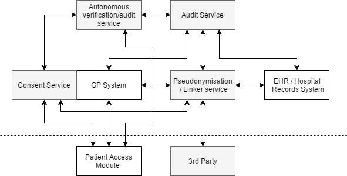
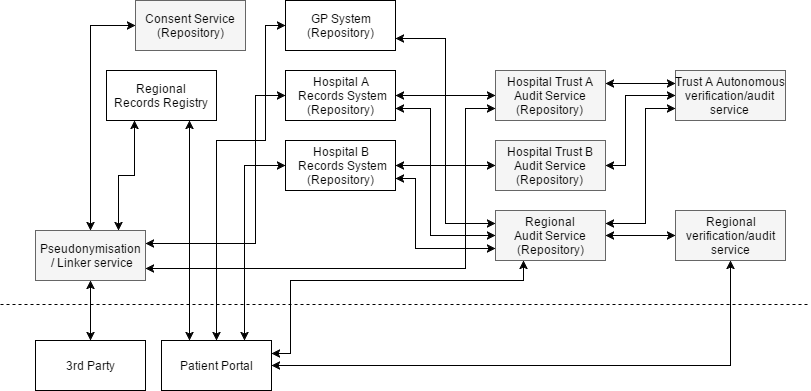

# On infrastructure for verifiable auditable access to healthcare records

## An Introduction
I have been thinking about this complex topic since the excellent talk by [Andrew Eland](https://twitter.com/andreweland) ([Technical solutions to keep health data safe and secure](https://www.youtube.com/watch?v=69ZgCkYDI8w)) at the [Interop Summit](http://www.interopsummit.com/) on the 2nd of March. In this talk he briefly outlined some of the key challenges and potential technical solutions in this area and introduced the concept of Merkle trees. Some of this talk is covered in a later [Blog post](https://deepmind.com/post/trust-confidence-verifiable-data-audit/) published by Google DeepMind.

This attempt to "put my thoughts to paper" was finally prompted by [Mark Wardle's](https://twitter.com/mwardle) [Blog post](http://wardle.org/information-governance/2017/03/19/information-governance.html) in which he asked about the real world potential of some of these solutions.

## The Problems (or at least some of them)
1.	_Tamper proof audit log_  
    A self-explanatory problem. Unlike a physical written log electronic logs are very easy to manipulate and tamper with. To maintain trust within the system audit logs need to be hardened technically against tampering.

2.	_Log which is opaque unless viewed by the referenced subject or an authorised party_  
    For an audit log to be trusted and verified it should be widely distributed and viewable by all. However, in healthcare this presents a distinct problem of information leakage. E.g if a log records that John Smith's CD4 count and viral load were accessed it is easy to surmise that John Smith probably has HIV. Therefore, it is necessary that log entries are opaque unless viewed by the subjects they refer to.

3.	_Ability to verify legitimacy of actions recorded in the log_  
    Alongside the above properties the log also needs to be interpretable by autonomous systems to check the legitimacy of actions using heuristics/AI to flag inappropriate access.

    Extra Problems:

4.	_Consent_  
    As more healthcare data becomes digital and encoded in a meaningful way (ie SNOMED CT) the ability to access this data for research, or share it for other purposes will become more relevant. Therefore it is important to be forward looking an try to anticipate how a consent model will fit within this process.

5.	_Third-party access and Pseudonymised data_  
    To facilitate research or provision of certain third-party services it will inevitably become necessary to provide both patient level and record level pseudonymisation of data.

## Piecing Things Together
[Adam Hatherly](https://twitter.com/adamhatherly) succinctly outlined some exciting designs for future healthcare record ecosystems in his talk ([The different designs of sharing platforms and the RESTful API future](https://www.youtube.com/watch?v=XByiQeXoOog) &mdash; [slides](https://drive.google.com/file/d/0Bwn8CEFskNi-NHRueXE2ZWRqWEE/view)) at the [Interop Summit](http://www.interopsummit.com/). This included my personal favourite a Registry Repository. However, it is important to be realistic about both the current state of electronic healthcare records in the UK and how these systems will likely change over the next 4 to 8 years. Sadly we are unlikely to be close to where I would want us to be (Registry Repository model) and are much more likely to be more deeply entrenched in the Single Shared Application (by incumbent vendors) model.

Consequently a solution for verifiable audit needs to be able to be implemented today but be designed in such a way that is can naturally transform to be fully functional within a different records model.

A high-level diagrammatic representation of how a system could fit into our current model of healthcare records:


 
This is a grossly simplified view of most healthcare records systems in the UK. Proposed new components are shaded grey. Initially an audit service would only record access by 3rd parties to healthcare records. In the future this could be expanded to all access by all users.

Here 3rd party access is through a Pseudonymisation Service that obscures patient identifiers when returning data in a reversible manner so returned data can be re-associated with the patient record. A walk-through of this system would go as follows:

1.	3rd party requests data from Pseudonymisation service.
2.	Pseudonymisation Service queries consent service checking for eligible patients.
3.	A prospective entry for each patient is made to the Audit Service by the pseudonymisation service detailing: The requesting 3rd party, The supporting consent, The data to be returned.
4.	Data is requested from the EHR / GP Systems
5.	The EHR / GP Systems check that entry exists with the Audit Service for the requested data and returns data.
6.	Pseudonymisation Service pseudonymises returned data and forwards to the requesting 3rd party.

Additional events/processes:

-	3rd party returns data to the Pseudonymisation service for entry into patient record, pseudonymous identifier translated and data forwarded to EHR / GP Record.
-	Autonomous verification service reviews all log entries using heuristics/AI to identify anomalous or inappropriate access. 
-	Patient logs-on to Patient Access Module and can review log entries about access to their data and any alerts generated by the Autonomous verification service

How this system could then adapt on transition to a Registry Repository model:



As with most distributed systems there is significantly more complexity (but greater flexibility and resilience) in this simplified view of a Registry Repository model. Existing audit components are shaded grey.

Within this model there are multiple Audit Services (like certificate transparency logs see below). Different repositories can then have different rules about how many and which Audit Services must contain entries before they will return data. Similarly different organisations can run verification services. 3rd party access happens through a similar pseudonymisation service. It is beyond the scope of this post to explain how a Registry Repository model functions.

## The Technical Stuff

As outlined above there many challenges to implementing a solution. Fortunately most of the key pieces of technology have already been developed. For their work on certificate transparency Google developed, and open-sourced, a [reference implementation](https://github.com/google/certificate-transparency) of a Merkle tree log. Public key cryptography is already a commodity component with several reliable implementations.

What follows is an outline using pseudo code/JSON to document how the component and the various protocols could work in a verifiable audit system. **THIS IS AN OUTLINE OF A STARTING POINT _NOT A SOLUTION_**.

### Some Concepts

#### Merkle trees
The main technical solution that has been floated to solve the problem of a verifiable audit log is the use of Merkle trees. The more technically astute among you will recognise Merkle trees from another Google innovation that has been quietly making the internet a safer place since March 2013. I am of course referring to [Certificate Transparency](https://en.wikipedia.org/wiki/Certificate_Transparency). The analogy of which fits much more neatly into healthcare records than some vague promissory mutterings of the mystical blockchain. Dense Merkle trees can be used to guarantee the historical integrity of an append only set of data, much like a Git repository and yes a blockchain. However unlike the former they have a neat mathematical elegance that makes the [verification process](https://www.certificate-transparency.org/log-proofs-work) efficient.

#### Public Key Cryptography
It would not be an understatement to say that public key cryptography is the foundation of modern encryption and security on the internet as we know it today. The history and development of this branch of cryptography while [fascinating](https://cryptome.org/ukpk-alt.htm) is well beyond the scope of this post as is [explaining](https://en.wikipedia.org/wiki/Public-key_cryptography) the concept. Briefly Wikipedia summarises:

> "Public key cryptography, or asymmetric cryptography, is any cryptographic system that uses pairs of keys: public keys which may be disseminated widely, and private keys which are known only to the owner… the paired private key can decrypt the message encrypted with the public key."

### Services

#### Consent Service
This would be a simple database service or key value store recording patient consent or dissent for various types of data access. It could also specify in the future specific Audit Services that access must be recorded to in addition to the requirements of a record repository. Each response should be signed by the consent service so authenticity of valid consent at the time of request can be later verified. It could offer the following interfaces:

`GET /consent/<patient_id>`  
Return all recorded consents/dissents for patient e.g.
```
{  
   "direct_care":{  
      "consent":true,
      "audit":[  
         "repository",
         "https://specific_regional"
      ]
   },
   "anonymous_research":{  
      "consent":true
   }
}
```

`GET /patients/<consent_type>`  
Returns all patients with valid consent for this type e.g
```
[  
   {  
      "patient_id":1234567890,
      "audit":[  
         "repository",
         "https://specific_regional_verifier"
      ]
   },
   {  
      "patient_id":2345678901
   }
]
```

#### Public Key Service
This is service that hasn't been mentioned in the above outlines but would be essential to this. These are also a commodity so would be beyond the scope to outline a proposed set of interfaces.

#### Private Key Store 
This would be a bridging service to hold the private key for patients until national infrastructure is in place to enable patients to have direct control of their keys or to delegate them to a trusted 3rd party. The infrastructure design for this is well beyond the scope of this post.

#### Audit Service
This is one of the key pieces of infrastructure. This could quite easily be constructed from adaptations to Google's [reference](https://github.com/google/trillian) [implementations](https://github.com/google/certificate-transparency). They key here is what data is stored in the log and in what format.

I propose the following is stored:

- _Patient Identifier_  
  To enable look-up of all entries about a specific patient.

- _Request Hash_  
  A request and patient specific hash that can be used as a pseudonymous identifier and/or be verified by a Records System Proxy to ensure that a log entry exists for a specific request.

- _Request Detail_  
  An encrypted blob containing the following: Details of requester, Human readable justification for request, Copy of relevant consent for request (signed by consent service), Human readable summary of requested data e.g. All blood tests for last month, Machine readable data request.

- _Keys_  
  Public key cryptography encrypted blob of the encryption key used to encrypt the request details. There will likely be multiple entries here e.g. Encrypted by patient public key to enable patient to view log entry, Encrypted by autonomous verification service public key to enable automated verification etc.

An interaction with the Audit Service would be as follows:

`POST /entry/new`
```
{  
   "patient_id":1234567890,
   "request_detail":{  
      "requester":"identifier_for_requesting_service/user",
      "justification":"To provide direct care while at St. Elsewhere",
      "consent":{  
         "consent":{  
            "patient_id":1234567890,
            "audit":[  
               "repository",
               "https://specific_regional_verifier"
            ]
         },
         "signature":{  
            "signer":"https://consent_store",
            "signature":"xxxencodedsignature"
         }
      },
      "request_desc":"Blood test results for the last 24h",
      "request":"select * from biochem, haem where requested > 24h"
   },
   "keys":[  
      "patient",
      "https://specific_regional_verifier",
      "disaster_recovery"
   ]
}
```

The Audit Service would generate a random salt and hash as follows: `salt` + `patient_id` + `request` to generate the request_hash.<sup>[1](#note1)</sup> A random key is generated and used to encrypt the whole request_detail object. The specified public keys are fetched from the Public Key Service and used to separately encrypt the random key. The following object would be stored in the log the hash added to the Merkle tree:

```
{  
   "patient_id":1234567890,
   "request_hash":"hashabcdef1234",
   "request_detail":"opaque_encrypted_blob",
   "keys":[  
      {  
         "public_key_identifier":"patient_1234567890",
         "encrypted_key":"encryptedblob"
      },
      {  
         "public_key_identifier":"https://specific_regional_verifier",
         "encrypted_key":"encryptedblob"
      },
      {  
         "public_key_identifier":"disaster_recovery",
         "encrypted_key":"encryptedblob"
      }
   ]
}
```

The following would be returned to the client, to provide enough information to a Records System Proxy to verify the request_hash is valid for the request:
```
{  
   "patient_id":1234567890,
   "request_hash":"hashabcdef1234",
   "salt":"randomsalt",
   "request":"select * from biochem, haem where requested = last24h"
}
```

#### Record Proxy/Middleware
This is service that hasn't been mentioned in the above outlines but would be essential to this. Depending on implementation this will either be a proxy/middleware in front of an EHR/Repository or be part of future Repositories. This service acts as a gatekeeper to the EHR/Repository and only permits access if there is a corresponding audit log entry.
An interaction would be as follows:

`POST /request/new`
```
{  
   "patient_id":1234567890,
   "request_hash":"hashabcdef1234",
   "salt":"randomsalt",
   "request":"select * from biochem, haem where requested > 24h",
   "audit_log":[  
      "https://specific_regional_audit_log",
      "https://alternate_log"
   ]
}
```

The Records Proxy/Middleware would verify the provided request_hash matches the associated request. If valid the specified Audit Services are queried to confirm that entries bearing the request_hash are present in the log. If satisfactory results are then returned to the client.

**Nb.** There are many ways to "skin the cat" of confirming an entry in the audit log each with pros and cons. I specifically elected to not use a signed token from the audit log as I feel that actual confirmation of presence in the log should be used over a presented assertion. Also note that this solution does nothing to prevent a replay attack of an old log entry with an open ended query that may return more data if replayed at a later date. There as simple and complex solutions to this but for a rough outline I feel this omission is acceptable.

#### Pseudonymisation/Linker Service
This acts as a gateway service. Requests are made to the service consent is verified & checked. Audit log entries are made. Records are requested. Patient identifiers are removed and replaced with the `request_hash`. Ingestion requests can be made against a request_hash to forward data onto the EHR/Repository. The audit log is simply queried for the `request_hash` and the associated `patient_id` returned to be used to forward data onwards to the EHR/Repository.

#### Autonomous verification/Audit Service
An independent and autonomous service that automagical scrutinises the audit log. As noted above each log entry can be decrypted by a number of public/private key pairs. Each entry will usually have several verification services keys associated with it. The service continually tails the audit log and uses a combination of rule based heuristics and AI to identify anomalous or inappropriate access.

## Where Next
This entry outlines my personal thoughts on how a set of services and infrastructure could be configured to provide verifiable auditable access to healthcare records. My technical outline is sparse and fails to address several key issues. However, this post will hopefully act a starting point for discussion about how to make some of these concepts a reality.

Hopefully going forward we can have an open discussion as a community about how to address some of these issues so that instead of being lumped with a finished solution fait accompli by a major vendor we can craft an open standards based solution that is "fit for purpose" and "future proof" or at least compatible with future extension.

I welcome any feedback, comments, criticism or suggestions on what I have outlined.

---
<a name="note1">[1]</a>: Yes my limited cryptography understanding says this is probably a bad idea see MAC-then-encrypt vs encrypt-then-MAC argument. However this post is only outlining a possible solution. Further thought and scrutiny should be applied before implementation.